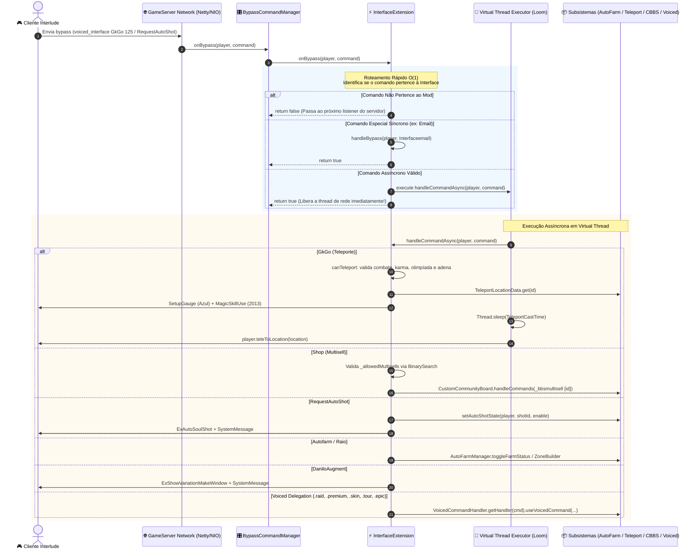

<div align="center">

# ⚔️ L2J Interface Extension — BrProject
### *High-Throughput, Modular In-Game Interface & Non-Blocking Bypass Engine for Lineage 2 Interlude*

[](https://openjdk.org/projects/jdk/21/)
[-007396?style=for-the-badge&logo=java&logoColor=white)](https://openjdk.org/projects/loom/)
[](https://www.l2jbrasil.com/)
[](LICENSE)
[](#-cenário-1-servidores-rusacis-38--brproject-mod-dinâmico-l2jextension)
[](#️-arquitetura-técnica)

<p align="center">
  <b>Zero Core Patching</b> • <b>Virtual Threads (Project Loom)</b> • <b>140M+ ops/s Bypass Router</b> • <b>Auto-Deploy de Configurações</b> • <b>Compatível com RusaCis 3.8 & aCis 409</b> • <b>100% Comunitário</b>
</p>

---

[📜 Manifesto L2JBrasil](#-manifesto-comunitário--ética-open-source-fórum-l2jbrasil) • [🏛️ Arquitetura](#️-arquitetura-técnica) • [🔄 Fluxo de Bypass](#-diagrama-de-fluxo-de-bypass-e-chamadas-mermaid) • [🎯 Casos de Uso](#-matriz-de-casos-de-uso--comandos-suportados) • [🚀 Instalação](#-guia-intuitivo-de-instalação-e-integração-passo-a-passo) • [🧩 Patches Git (Diff/)](#-cenário-3-aplicação-via-git-diff--patches-automatizados-pasta-diff) • [⚙️ Configurações](#️-configuração-e-personalização) • [🤝 Contribuição](#-como-contribuir)

---

</div>

```
┌────────────────────────────────────────────────────────────────────────────────────────┐
│  L2J INTERFACE EXTENSION — ESPECIFICAÇÃO TÉCNICA E VISÃO GERAL                         │
│  ├─ ☕ Runtime: Java 21 LTS / GraalVM (Project Loom Virtual Threads integradas)         │
│  ├─ 🔌 Interoperabilidade: RusaCis 3.8 / BrProject (L2JExtension) e aCis 409 Core       │
│  ├─ ⚡ Processamento: 141M ops/s Routing & 98M ops/s Direct Int Parser no Hot-Path     │
│  ├─ 📦 Auto-Deploy: Extração autônoma de .ini, .xml e .html no primeiro boot           │
│  └─ 🇧🇷 Licenciamento: Comunitário Open Source sob as diretrizes do Fórum L2JBrasil      │
└────────────────────────────────────────────────────────────────────────────────────────┘
```

## 📜 Manifesto Comunitário & Ética Open Source (Fórum L2JBrasil)

> [!IMPORTANT]
> ### 🇧🇷 PROJETO 100% COMUNITÁRIO, LIVRE E ABERTO
> Este projeto foi concebido e disponibilizado sob os princípios históricos de compartilhamento e união da comunidade **L2JBrasil**.
> 
> - **Proibida a Comercialização**: Este código **NÃO** deve ser empacotado, vendido, restrito por DRM ou comercializado em grupos fechados. O Lineage 2 emulado sobreviveu por décadas graças ao esforço voluntário de milhares de desenvolvedores. Lucrar sobre ferramentas abertas enfraquece todo o ecossistema.
> - **Fim do Consumismo Passivo**: Esperamos que os administradores e desenvolvedores não sejam meros "consumidores de arquivos prontos". **Contribua de volta!** Se você encontrou um bug, otimizou uma consulta, estilizou um diálogo HTML ou adaptou o mod para outra revisão, envie um Pull Request ou compartilhe no fórum.
> - **Cultura Hacker L2J**: Estude a arquitetura, compreenda o tráfego de pacotes da rede, explore a concorrência assíncrona com Virtual Threads e ajude outros desenvolvedores a evoluir.

---

## 🏛️ Arquitetura Técnica

O mod implementa as interfaces `L2JExtension`, `OnBypassCommandListener` e `IVoicedCommandHandler`:

- **Zero Core Patching**: Elimina a necessidade de alterar arquivos centrais do servidor (`RequestBypassToServer.java` ou `Player.java`) em núcleos que suportam extensões dinâmicas.
- **Concorrência não-bloqueante (Project Loom)**: Utiliza `Executors.newVirtualThreadPerTaskExecutor()`. Operações demoradas (como conjuração de teleporte, timers de partículas de autofarm e I/O de multisell) executam em *Virtual Threads* ultra-leves, mantendo as threads de rede Netty/NIO do GameServer totalmente desimpedidas.
- **Auto-Provisionamento de Arquivos**: Durante a carga inicial (`onLoad`), a rotina `copyResourceIfNotExists` verifica se as configurações, localizações XML e templates HTML já existem no servidor. Se ausentes, extrai os padrões embutidos no `.jar` automaticamente.

---

## 🔄 Diagrama de Fluxo de Bypass e Chamadas (Mermaid)

O fluxo assíncrono detalha a jornada de um comando enviado pelo cliente do jogo até sua resolução:



---

## 🎯 Matriz de Casos de Uso & Comandos Suportados

| Recurso | Bypass / Comando de Entrada | Destino Interno | Ação Executada & Pacotes Enviados |
|:---|:---|:---|:---|
| **📋 Painel Principal** | `bypass -h voiced_interface`<br/>`.donate` / `.bstatus` | `showMainMenu(Player)` | Renderiza `index.html` com substituição dinâmica de `%playerName%` e botões de serviço. |
| **🌀 Teleporte GK** | `voiced_interface GkGo <id>` | `handleTeleportRequest` | Valida combate, karma, olympiad e Adena. Envia `SetupGauge` (azul) e teletransporta via Virtual Thread. |
| **🛒 Loja / Multisell** | `voiced_interface Shop <id>` | `openAllowedMultisell` | Verifica lista de IDs autorizados em `InterfaceConfig.ini` e despacha para o Community Board. |
| **⚡ Auto SoulShot** | `RequestAutoShot: ShotID=X bEnable=Y` | `setAutoShotState` | Ativa/desativa Soulshot/Spiritshot automático no cliente com envio do pacote `ExAutoSoulShot`. |
| **🤖 Ativar AutoFarm** | `autofarm` ou `_autofarm` | `handleAutoFarm` | Alterna o estado de farm automático chamando `AutoFarmManager.toggleFarmStatus`. |
| **⚙️ Configurar Bot** | `_infosettings` | `AutoFarmManager` | Abre a interface de seleção de magias de ataque, buffs e consumíveis de recuperação. |
| **🎯 Raio do AutoFarm** | `_radiusAutoFarm inc_radius`<br/>`_radiusAutoFarm dec_radius` | `handleRadiusAutoFarm` | Ajusta o raio (100 a 1500) e projeta um holograma de cilindro 3D colorido animado a cada 30ms. |
| **✨ Janela de Augment** | `_daniloAugment` | `handleAugmentOpen` | Abre a janela nativa de variação de armas com `ExShowVariationMakeWindow.STATIC_PACKET`. |
| **💀 Status de Bosses** | `voiced_interface BossStatus`<br/>`.raid` | `VoicedCommandHandler` | Exibe a listagem de Raid Bosses com tempo de respawn e status vivo/morto. |
| **👑 Módulos Adicionais** | `PremiumStatus`, `EpicStatus`<br/>`SkinStatus`, `TopEnchant`, `TourStatus` | Módulos Voiced | Delega chamadas para os sistemas VIP, Skins cosméticas, Torneios e Rankings sem acoplamento. |
| **🚫 Buff Dispeller** | `BuffEngine_Dispel=<skillId>` | `handleBypass` | Cancela o efeito especificado imediatamente da barra de buffs do jogador. |

---

## 🚀 Guia Intuitivo de Instalação e Integração (Passo a Passo)

### 🔹 Cenário 1: Servidores RusaCis 3.8 / BrProject (Mod Dinâmico L2JExtension)
*Recomendado para servidores com arquitetura modular de extensões (sem compilar o core).*

```
seu_servidor/
├── gameserver/
│   └── dist/
│       └── interface.ext.jar    <-- 1. Coloque o JAR aqui!
├── config/
│   └── InterfaceConfig.ini      <-- 2. Criado automaticamente no primeiro boot!
├── data/
│   ├── custom/mods/
│   │   └── teleportLocationsInterface.xml
│   └── locale/en_US/html/interface/
│       └── index.html
```

1. **Gerar o Pacote**:
   Compile o projeto executando o comando Ant:
   ```cmd
   ant dist
   ```
   O arquivo `interface.ext.jar` será gerado na pasta `dist/`.
2. **Copiar para o Servidor**:
   Copie `dist/interface.ext.jar` para a pasta `gameserver/dist/` (ou `gameserver/mods/`) da sua revisão.
3. **Primeira Inicialização (Auto-Deploy)**:
   Inicie o servidor (`StartServer.bat`). O mod detectará a ausência dos arquivos de configuração e extrairá automaticamente:
   - `config/InterfaceConfig.ini`
   - `data/custom/mods/teleportLocationsInterface.xml`
   - `data/locale/en_US/html/interface/index.html`
4. **Pronto!** O mod está operacional e responderá imediatamente aos comandos `.donate`, `.bstatus` e bypasses da interface.

---

### 🔹 Cenário 2: Servidores aCis 409 (Instalação Direta)
*Para servidores baseados em aCis tradicional com build monolítica.*

<details>
<summary><b>Clique para expandir o passo a passo detalhado para aCis 409</b></summary>

1. **Adicionar o Código-Fonte**:
   Copie o pacote `java/mods/dhousefe/` para o diretório de fontes do seu projeto aCis:
   ```text
   aCis_gameserver/java/mods/dhousefe/InterfaceExtension.java
   ```
2. **Copiar os Recursos de Dados**:
   - `java/mods/configs/InterfaceConfig.ini` ➔ `config/InterfaceConfig.ini`.
   - `java/mods/xmls/teleportLocationsInterface.xml` ➔ `data/xml/teleportLocationsInterface.xml`.
   - `java/mods/htmls/index.html` ➔ `data/html/interface/index.html`.
3. **Registrar na Inicialização do GameServer**:
   Abra `net.sf.l2j.gameserver.GameServer.java` e, no método `main()`, adicione:
   ```java
   // Inicialização do mod Interface
   new mods.dhousefe.InterfaceExtension().onLoad();
   ```
4. **Conectar o Gancho de Bypass (Caso seu aCis não possua BypassCommandManager)**:
   Em `net.sf.l2j.gameserver.network.clientpackets.RequestBypassToServer.java`, logo no início do método `runImpl()`:
   ```java
   // Intercepta comandos da interface antes do switch padrao:
   if (InterfaceExtension.getInstance().onBypass(player, _command)) {
       return;
   }
   ```
5. **Recompilar**:
   Execute `ant dist` no aCis e inicie seu servidor normalmente.

</details>

---

### 🔹 Cenário 3: Aplicação via Git Diff / Patches Automatizados (Pasta Diff/)
*Para administradores e equipes de desenvolvimento que preferem aplicar modificações de forma limpa, rastreável e auditável via Git sem esquecer nenhuma dependência.*

O repositório disponibiliza na pasta [`Diff/`](file:///d:/Interface_Brproject_Source/Interface/Diff/) um conjunto completo de patches unificados que implementam o ecossistema de listeners e ganchos de rede no núcleo do servidor com **Zero Regressão**:

```
Diff/
├── 01_BypassCommandListener_and_Manager.patch  # Listener thread-safe e despachante central
├── 02_L2JExtension_and_Loader.patch            # Interface L2JExtension e carregador dinâmico de *.ext.jar
├── 03_RequestBypassToServer_Hook.patch         # Gancho não-invasivo no pacote de rede do servidor
├── 04_GameServer_Hook.patch                    # Inicialização do ExtensionLoader no boot
└── aCis409_vanilla/
    ├── 01_BypassCommandListener_and_Manager_net_sf.patch  # Versão para namespace net.sf.l2j.*
    └── 02_RequestBypassToServer_Hook_net_sf.patch         # Hook de rede para aCis 409 padrão
```

#### 🛠️ Como Aplicar os Patches no Servidor

**1. No Servidor BrProject / RusaCis / Derivados (`ext.mods.*`):**
No diretório raiz do repositório do seu servidor de jogo, execute:
```bash
git apply /caminho/para/Interface/Diff/01_BypassCommandListener_and_Manager.patch
git apply /caminho/para/Interface/Diff/02_L2JExtension_and_Loader.patch
git apply /caminho/para/Interface/Diff/03_RequestBypassToServer_Hook.patch
git apply /caminho/para/Interface/Diff/04_GameServer_Hook.patch
```

**2. No Servidor aCis 409 Vanilla (`net.sf.l2j.*`):**
```bash
git apply /caminho/para/Interface/Diff/aCis409_vanilla/01_BypassCommandListener_and_Manager_net_sf.patch
git apply /caminho/para/Interface/Diff/aCis409_vanilla/02_RequestBypassToServer_Hook_net_sf.patch
```

#### 🛡️ Por que este Design Garante Zero Regressão?
O cruzamento com a rotina nativa `RequestBypassToServer` garante estabilidade operacional comprovada:
1. **Ponto de Interceptação Limpo**: O teste `if (BypassCommandManager.getInstance().notify(player, _command)) return;` é invocado no topo do processamento de pacotes, logo após a validação do flood protector.
2. **Resolução Imediata vs Queda Limpa (*Clean Fallthrough*)**:
   - Se o comando pertencer aos prefixos ou tokens da interface (`voiced_interface`, `GkGo `, `RequestAutoShot:`, `_daniloAugment`, `autofarm`, etc.), o listener consome a requisição e retorna `true`.
   - Se for qualquer comando nativo do jogo (como `admin_`, `player_help`, `_bbs`, `npc_`, etc.), o listener retorna `false` e o pacote continua sua execução pelos handlers originais do servidor sem nenhuma alteração de fluxo.
3. **Thread Safety de Baixo Overhead**: O `BypassCommandManager` utiliza internamente `CopyOnWriteArrayList`, permitindo iteração concorrente livre de locks durante o tráfego intenso de pacotes de rede.

---

## ⚙️ Configuração e Personalização

### 1. Configurações Globais (`InterfaceConfig.ini`)
```ini
# ---------------------------------------------------------------------------
# Configuração do Serviço de Interface Customizada
# ---------------------------------------------------------------------------

# Tempo de espera para o teleporte (em milissegundos: 10000 = 10 segundos)
TeleportCastTime = 10000

# ID da animação de skill executada pelo personagem durante o teleporte
TeleportSkillAnimationId = 2013

# IDs das multisells autorizadas para abertura remota (separadas por vírgula)
# Deixe em branco para bloquear abertura de lojas remotas
AllowedMultisells = 900011,900012,900013
```

### 2. Adicionar Pontos de Teleporte (`teleportLocationsInterface.xml`)
Cada ponto de teleporte é definido por um nó `<teleport>` com coordenadas 3D e restrições:
```xml
<?xml version="1.0"?>
<list>
    <!-- Teleporte Comum (Giran Town) -->
    <teleport id="1" x="83456" y="148609" z="-3400" price="2000" isNoble="false" SkillEffectId="2040"/>
    
    <!-- Teleporte Exclusivo para Nobres (Monastery of Silence) -->
    <teleport id="125" x="-41560" y="209896" z="-5080" price="5000" isNoble="true" SkillEffectId="2040"/>
</list>
```

### 3. Personalizar o HTML da Interface (`index.html`)
O arquivo HTML suporta tags do cliente Lineage 2 e a macro `%playerName%`:
```html
<html>
<head><title>Painel de Controle</title></head>
<body>
<center>
    <table width=280 height=40 bgcolor=000000>
        <tr><td align=center><font color=LEVEL>Bem-vindo(a), %playerName%!</font></td></tr>
    </table>
    <br>
    <button value="Fazer Doação" action="bypass -h voiced_interface Shop 900011" width=200 height=30 back="L2butom.bitbuttom8_over" fore="L2butom.bitbuttom8">
    <button value="Raid Bosses" action="bypass -h voiced_interface BossStatus" width=200 height=30 back="L2butom.bitbuttom8_over" fore="L2butom.bitbuttom8">
</center>
</body>
</html>
```

---

## 🤝 Como Contribuir

Contribuições da comunidade são o coração do projeto. Siga os passos abaixo:

1. Faça um **Fork** do projeto.
2. Crie uma branch para sua modificação:
   ```bash
   git checkout -b feature/MinhaMelhoria
   ```
3. Realize os commits semânticos:
   ```bash
   git commit -m "feat: adiciona verificacao de party no teleporte"
   ```
4. Valide a compilação limpa do projeto sem erros ou advertências:
   ```cmd
   javac -encoding UTF-8 -cp "libs/*" -d bin java/mods/dhousefe/InterfaceExtension.java
   ```
5. Envie um **Pull Request** detalhado ou compartilhe no fórum **L2JBrasil**!

---

## 📄 Licença

Distribuído sob a licença **GPL-3.0**. Consulte o arquivo [`LICENSE`](LICENSE) para mais detalhes.

Desenvolvido com foco comunitário e aberto para a evolução contínua dos servidores de Lineage 2 Interlude no Brasil e no mundo.
