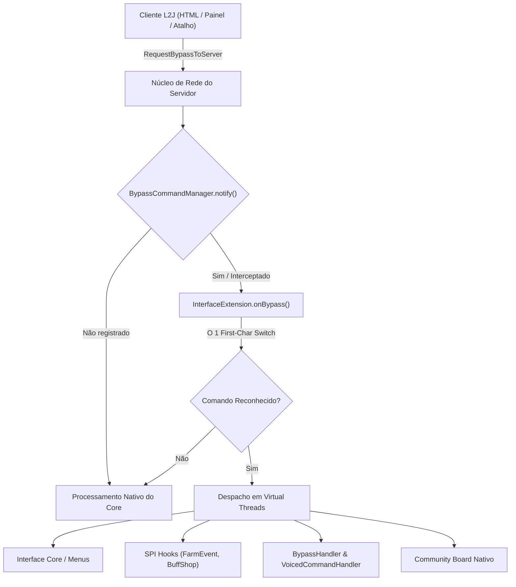
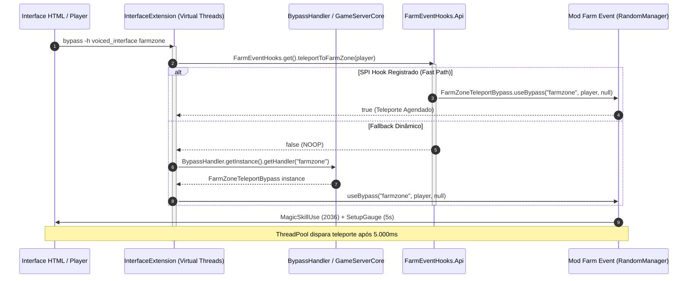

# Mapeamento Técnico de Interações da Interface, Bypasses de Rede & Integração SPI

Este documento consolida a especificação técnica e o mapeamento completo de todas as interações da interface de usuário (`HTML`), pacotes de rede (`RequestBypassToServer`), roteamento na extensão (`InterfaceExtension.java`) e execução nos módulos do servidor (`BrProject-2026`).

---

## 1. Visão Geral da Arquitetura de Interceptação

A arquitetura de processamento opera em modelo **Zero Overhead**:
1. O cliente envia uma requisição de bypass por meio de diálogo HTML, botão da interface ou atalho.
2. O pacote de rede `RequestBypassToServer` intercepta a chamada na camada de rede antes da árvore de decisão do emulador:
   ```java
   if (BypassCommandManager.getInstance().notify(player, _command))
       return;
   ```
3. A extensão `InterfaceExtension` implementa `OnBypassCommandListener` e avalia o comando via **First-Char Switch em O(1)**.
4. Caso o comando pertença ao subsistema da interface, ele é consumido (`return true`) e despachado de forma assíncrona usando **Virtual Threads**, desonerando imediatamente a thread de rede do Netty.
5. Caso não seja um comando reconhecido pela extensão, `onBypass` retorna `false`, permitindo que o núcleo nativo do jogo processe os bypasses convencionais (`npc_`, `admin_`, `_bbs`, etc.) sem qualquer regressão (**Clean Fallthrough**).



---

## 2. Tabela de Mapeamento Completo da Janela Principal (`index.html`)

A janela principal da interface (`mods/htmls/index.html` e `game/data/locale/en_US/html/interface/index.html`) apresenta botões padronizados no formato Interlude `bitbuttom8` (`width=240 height=22`):

| # | Rótulo do Botão | Ação HTML (`action`) | Roteamento `InterfaceExtension` | Handler / Destino no Servidor | Módulo Responsável | Comportamento / Ação Executada |
|---|---|---|---|---|---|---|
| 1 | **Character Email** | `bypass -h voiced_interface Interfaceemail` | `case "Interfaceemail"` | `VoicedCommandHandler("email")` | `mod-email` | Abre a caixa de correio eletrônico in-game do personagem. |
| 2 | **Make Donate** | `bypass -h voiced_interface Shop 900011` | `case "Shop"` / `case "donate"` | `CustomCommunityBoard("_bbsgetfav_add")` | `game-server-core` | Abre a aba de doações e loja de serviços no Community Board. |
| 3 | **Sell Buff Engine** | `bypass -h voiced_interface BuffEngine_Dhousefe` | `case "BuffEngine_Dhousefe"` | `UserCommandHandler(203)` (`/buff`) / `BuffShopHooks` | `mod-buff-shop` | Abre o painel de configuração e venda de buffs pessoais (Buff Shop). |
| 4 | **Profession** | `bypass -h _bbsmemo` | *Nativo Core (Fallthrough)* | `CommunityBoardMemoHandler` | `game-server-core` | Abre o menu de troca de classe / Class Master. |
| 5 | **Raid Boss Status** | `bypass -h voiced_interface BossStatus` | `case "BossStatus"` | `VoicedCommandHandler("raid")` | `game-server-core` | Exibe a lista e status de renascimento dos Raid Bosses. |
| 6 | **Epic Boss Status** | `bypass -h voiced_interface EpicStatus` | `case "EpicStatus"` | `VoicedCommandHandler("epic")` | `game-server-core` | Exibe a janela de status dos Grand/Epic Bosses mundiais. |
| 7 | **Premium** | `bypass -h voiced_interface PremiumStatus` | `case "PremiumStatus"` | `VoicedCommandHandler("premium")` | `game-server-core` | Exibe o status da conta VIP / ativação de plano Premium. |
| 8 | **Character Skin** | `bypass -h voiced_interface SkinStatus` | `case "SkinStatus"` | `VoicedCommandHandler("skin")` | `mod-dressme` | Abre o guarda-roupas visual e sistema DressMe / Skins. |
| 9 | **Top Enchant** | `bypass -h voiced_interface TopEnchant` | `case "TopEnchant"` | `VoicedCommandHandler("topenchant")` | `game-server-core` | Exibe o ranking de itens mais encantados do servidor. |
| 10 | **Tournament Lobby** | `bypass -h voiced_interface TourStatus` | `case "TourStatus"` | `VoicedCommandHandler("tour")` | `mod-tour` | Abre a interface de registro em torneios e arenas PvP. |
| 11 | **Farm Event** | `bypass -h voiced_interface farmzone` | `case "farmzone"` | `FarmEventHooks.teleportToFarmZone` / `FarmZoneTeleportBypass` | `mod-farm-event` | Teleporta o jogador para a Farm Zone ativa com 5s de cast e barra visual. |

---

## 3. Mapeamento de Bypasses Rápidos & Ações em Hot-Path

Além do menu principal, o motor da extensão gerencia comandos acionados por pacotes customizados do cliente e botões rápidos:

### 3.1 Consumo e Troca Rápida de AutoShots
- **Comando**: `RequestAutoShot:<itemId>:<enable>`
- **Exemplo**: `RequestAutoShot:1463:1` (Ativar Soulshot C-Grade)
- **Processamento**:
  - Validado via método `handleRequestAutoShot(Player player, String command)`.
  - Parser numérico direto sem alocação intermediária de strings (`Integer.parseInt` no trecho).
  - Consulta o inventário do jogador (`player.getInventory().getItemByItemId(...)`).
  - Ativa/desativa via `player.activateAutoSoulShot(...)` com disparo de `MagicSkillUse` e atualização de interface.

### 3.2 Gatekeeper & Teleporte O(1)
- **Comando**: `GkGo <x> <y> <z> <price>`
- **Exemplo**: `GkGo 83400 147943 -3404 1000`
- **Processamento**:
  - Extração de coordenadas e custo em `handleTeleportRequest`.
  - Verificação de saldo de Adena (`player.reduceAdena(...)`).
  - Efeito visual de retorno `SOE_VISUAL_SKILL_ID` (2036), gauge de 5 segundos e agendamento de teleporte seguro via `ThreadPool.schedule`.

### 3.3 Motor de AutoFarm Integrado
- **Comando**: `autofarm <ação>` / `_autofarm`
- **Exemplo**: `autofarm enable`, `autofarm page 1`, `_radiusAutoFarm 1500`, `_infosettings`
- **Processamento**:
  - Roteamento para `AutoFarmManager.getInstance().handleBypass(player, command)`.
  - Suporte a seleção de raio (`ZoneBuilder.buildCircle(...)`) e páginas de configuração de skills/potions.

### 3.4 Dispensa Rápida de Efeitos de Buff (Dispel)
- **Comando**: `BuffEngine_Dispel <skillId>`
- **Exemplo**: `BuffEngine_Dispel 1068`
- **Processamento**:
  - Extração do ID da habilidade.
  - Execução de `player.stopSkillEffects(skillId)`.

### 3.5 Abertura Instantânea de Augmentation
- **Comando**: `_daniloAugment`
- **Processamento**:
  - Envio direto do pacote nativo de interface de Augment: `player.sendPacket(new ExShowVariationMakeWindow())`.

---

## 4. Integração de NPCs Globais: Gatekeeper (`50010.htm`)

A Gatekeeper Global (`game/data/locale/en_US/html/gatekeeper/50010.htm` e `game/data/locale/ru_RU/html/gatekeeper/50010.htm`) possui integração direta com o módulo de Farm Event:

| Linha HTML | Ação de Bypass | Handler no Servidor | Comportamento |
|---|---|---|---|
| Linha 69 (`50010.htm`) | `bypass -h npc_%objectId%_farmzone` | `BypassHandler.getInstance().getHandler("farmzone")` | Invoca `FarmZoneTeleportBypass.useBypass(...)`, executa verificação de zonas ativas em `RandomManager`, inicia a barra azul de cast de 5 segundos e teleporta para um ponto seguro de spawn ou monstro da zona ativa. |
| Suporte Legado | `bypass -h npc_%objectId%_pvp` | `BypassHandler.getInstance().getHandler("pvp")` | Compatibilidade retroativa garantida via array `COMMANDS` em `FarmZoneTeleportBypass`. |

---

## 5. Arquitetura de Comunicação Multi-Módulo (SPI Bridges)

Para assegurar isolamento estrito entre os módulos Gradle (`mod-farm-event`, `mod-buff-shop`, etc.) e o núcleo do servidor (`game-server-core`), foram criadas **pontes SPI tipadas** (`ext.mods.extensions.hooks.*`):



### 5.1 Registro Dinâmico de Extensões
Como o `AbstractHandler` carrega estaticamente apenas os handlers do classpath central no boot do jogo, módulos desacoplados registram seus manipuladores dinamicamente em seu ciclo de vida:

```java
// Em FarmEventExtension.java
@Override
public void onEnable(ExtensionContext context) {
    _bypassHandler = new FarmZoneTeleportBypass();
    BypassHandler.getInstance().registerHandler(_bypassHandler);
    
    _voicedHandler = new FarmZoneTeleport();
    VoicedCommandHandler.getInstance().registerHandler(_voicedHandler);
    
    FarmEventHooks.register(new FarmEventHooks.Api() {
        @Override
        public boolean teleportToFarmZone(Player player) {
            return _bypassHandler != null && _bypassHandler.useBypass("farmzone", player, null);
        }
        // ...
    });
}

@Override
public void onDisable(ExtensionContext context) {
    if (_bypassHandler != null) {
        BypassHandler.getInstance().unregisterHandler(_bypassHandler);
        _bypassHandler = null;
    }
    if (_voicedHandler != null) {
        VoicedCommandHandler.getInstance().unregisterHandler(_voicedHandler);
        _voicedHandler = null;
    }
    FarmEventHooks.clear();
}
```

---

## 6. Procedimento de Compilação, Empacotamento & Deploy

### 6.1 Compilação do Core e Módulos do Servidor (`BrProject-2026`)
```cmd
cd D:\Brproject3.0\BrProject-2026
gradlew.bat :app-dist:jar
```
*Gera `libs/server.jar` com todos os módulos opcionais empacotados e manifesto SPI unificado.*

### 6.2 Compilação e Deploy da Extensão da Interface (`Interface`)
```cmd
cd D:\Interface_Brproject_Source\Interface
scripts\build_and_deploy.bat
```
*Compila `InterfaceExtension.java`, unifica recursos (XML, INI, HTML), gera `dist/interface.ext.jar` e implanta diretamente em `D:\Brproject3.0\BrProject-2026\libs\interface.ext.jar`.*
